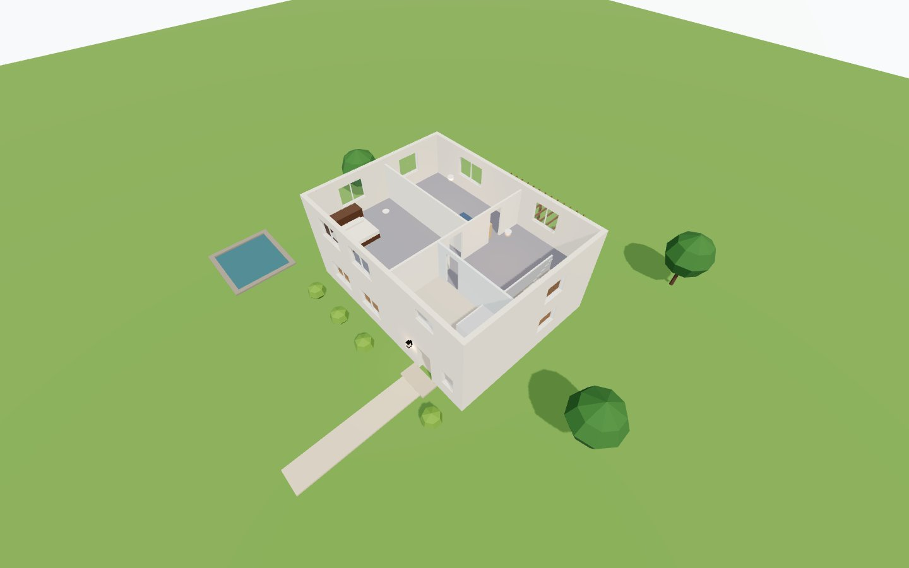

# JARVIS

[](https://github.com/edspencer/jarvis/actions/workflows/ci.yml)
[](https://github.com/edspencer/jarvis/releases)
[](https://github.com/edspencer/jarvis/pkgs/container/jarvis)
[](LICENSE)

A browser walkthrough for a building's digital twin (three.js): walk or orbit a glTF model, inspect objects, and layer
live data on it through plugins (Home Assistant, an equipment registry, wall plates, blueprints, …).

The viewer holds no building: everything about one comes from a **site folder** with a `site.json` manifest
([schema](schema/site.schema.json)) and a model that follows the [model format](docs/model-format.md).



**Live demo:** https://edspencer.github.io/jarvis/ (the demo house with mock Home Assistant data)

Licence: MIT ([LICENSE](LICENSE)). Third-party licences: [THIRD_PARTY_NOTICES.md](THIRD_PARTY_NOTICES.md).

## Documentation

[docs/README.md](docs/README.md) indexes it all. To start:

- [Your own building](docs/guide/your-own-building.md): from a model to a working site folder, step by step
- [Writing a plugin](docs/guide/writing-a-plugin.md), and the plugin API reference, [docs/plugins.md](docs/plugins.md)
- [The model format](docs/model-format.md) (`jarvis-model/1`) and the [manifest schema](schema/site.schema.json)
  (`jarvis-site/1`)
- [Deploying](docs/deploy.md), [releasing](RELEASING.md), [security](SECURITY.md)

## Status / roadmap

Done:

- the viewer: walk (collision, stairs, crouch, ghost flight) or orbit, cutaway and storey toggles, picking and the
  inspector, search, a sun placed by the site's latitude, longitude and time zone
- the site manifest, `jarvis-site/1`, with a JSON Schema and `npm run validate-site`
- the model format, `jarvis-model/1`: node names, extras and layer rules that turn on features
- the plugin API (`jarvis/plugin`, [docs/plugins.md](docs/plugins.md)); the core uses it too. Built in: Home
  Assistant, lights, faults, equipment pins, wall plates, blueprints, sun
- the HUD: Lit components (rail, dock, inspector, status strip, search, help generated from the key registry)
- releases: a container image on GHCR and a static tarball, cut with changesets
- touch: phones get bottom sheets and a tab bar; walking on a touch screen has a thumb-stick, drag to look and tap to
  inspect (a phone opens in the overview; the strip's Walk switch walks)
- the demo house, synthetic, which the tests, CI and the live demo run on

Next:

- an **Energy** plugin, vendor-neutral: live power and energy from Home Assistant sensors, shown on the circuits,
  appliances and rooms they feed (in progress)
- a **voice assistant**: an optional assistant server (Claude Agent SDK) that talks, acts through Home Assistant under
  a server-enforced allow / confirm / deny policy, knows the site and drives the view; hold-to-talk first, a wake word
  and Home Assistant voice satellites later. Designed, not built: [docs/design/voice-assistant.md](docs/design/voice-assistant.md)

## Develop

Needs Node 22.18 or newer.

```sh
npm install            # if NODE_ENV=production is set in your shell: npm install --include=dev
npm run dev            # http://localhost:5173, with the demo house; add ?ha=mock for a made-up Home Assistant
```

The demo house ([`examples/demo-site`](examples/demo-site)) is a small synthetic two-storey building generated by
`tools/make-demo-site.ts` (`npm run demo-site`). It uses most of what the viewer does: rooms, a stair, cutaway and
storey toggles, a site layer (the pergola, K), a furniture model (F), light fixtures with mock Home Assistant, wall
plates, equipment pins, device faults and blueprint sheets. The tests and CI run against it. See
[CONTRIBUTING.md](CONTRIBUTING.md) to work on the viewer; contributors follow the
[Code of Conduct](CODE_OF_CONDUCT.md).

### The site folder

The app holds no building. One building's manifest, model and data files live in a **site folder**, served next to the
app (never bundled into it). Point `JARVIS_SITE` at one in development (default `examples/demo-site`; keep your own
under `sites/`, which git ignores):

```sh
JARVIS_SITE=sites/mine npm run dev
```

The viewer reads `site.json` next to the page, or the manifest named by `?site=<url>` (relative to the page or
absolute; a manifest on another origin needs CORS for it and its files). Paths in the manifest are relative to the
manifest. A missing or invalid manifest is listed, field by field, on the loading screen.

### Your own building

The short version; [the guide](docs/guide/your-own-building.md) has the detail.

1. Export the building as glTF (metres, Y up), ideally compressed with `gltfpack -cc -tc -kn -ke -km` (`-kn -ke -km`
   keep the node names, extras and materials the viewer reads). Name the nodes or write layer rules as the
   [model format](docs/model-format.md) describes: floors with a `room` extra, roofs, ceilings, doors, light fixtures
   with a `fixture_id`. A plain model works too; each convention adds a feature.
2. Make a folder with the model and a `site.json`. The minimum:

   ```json
   {
     "jarvis": "jarvis-site/1",
     "id": "my-house",
     "name": "My house",
     "geo": { "lat": 51.5007, "lon": -0.1246, "timeZone": "Europe/London" },
     "models": { "main": { "url": "model.glb" } },
     "viewpoints": [{ "name": "Front door", "at": [10, -5, 0], "yaw": 0 }]
   }
   ```

   Viewpoints are in the plan frame: X east, Y north, Z up, in feet unless `frame.units` is `"m"`; yaw 0 looks plan
   north, 90 west.

3. Check it: `npm run validate-site -- path/to/folder` (the manifest against the schema, every file it names, the
   models against the model format), then `JARVIS_SITE=path/to/folder npm run dev`. Keep a real building's folder
   under `sites/` (git-ignored) or outside the checkout.

More of the manifest, all optional (the [schema](schema/site.schema.json) documents every field):

```jsonc
{
  "frame": { "units": "m", "northAzimuth": 12.5 }, // true bearing of plan +Y; the sun depends on it
  "centre": [20, 15], // the building's centre: shadows, far ground, overview
  "overview": { "camera": [60, -40, 40] },
  "ground": { "z": -0.2 }, // the far ground, just under the site's grade
  "models": {
    "main": { "url": "model.glb", "parts": "model.parts.json" },
    "extra": [{ "id": "furniture", "url": "furniture.glb", "layer": "furniture" }],
  },
  "storeys": [
    { "name": "ground floor", "z": 0 },
    { "name": "first floor", "short": "upstairs", "z": 3.2, "from": 1.8, "objectsFrom": 2.9 },
  ],
  "startView": 1,
  "layers": [
    // roof, ceiling and door are built in (X, U, O); add your own toggles with a free key
    { "id": "door", "match": { "extra": ["door_leaf"], "material": ["door_oak"] } },
    { "id": "pergola", "label": "Pergola", "key": "K", "help": "the pergola", "match": { "namePrefix": ["Pergola_"] } },
    { "id": "furniture", "label": "Furniture", "key": "F", "help": "the furniture" },
  ],
  "materials": { "glass": ["glass"], "water": ["pond"], "screens": { "insect_screen": { "wire": 0.2 } } },
  "colliders": { "passable": { "namePrefix": ["Win_"], "extra": ["passable"] } },
  "walk": { "maxStep": 0.4 }, // metres; also eyeHeight, crouchEyeHeight, radius
  "plugins": {
    "home-assistant": { "url": "https://homeassistant.example.org", "controls": "ha_controls.json" },
    "lights": { "map": "ha_map.json" }, // which entities light each fixture
    "faults": { "devices": "ha_devices.json" },
    "pins": { "registry": "registry_pins.json", "sourceLink": "https://example.org/repo/{file}" },
    "switches": {},
    "blueprints": { "index": "blueprints/index.json", "default": "A-1" },
    "energy": { "map": "energy.json" }, // the meters and what they feed: docs/plugins/energy.md
  },
}
```

A plugin starts only if the manifest has its section under `plugins` (the sun panel and the wall plates start on
their own; the plates only if the model has some), and only its code is downloaded. Everything on screen comes from
plugins through one API, the core included: see [Writing a plugin](docs/guide/writing-a-plugin.md) and the API
reference, [docs/plugins.md](docs/plugins.md). A plugin of your own needs no fork: build it into one ES module and give
the site a section that names it (`"measure": { "module": "plugins/measure.js" }`), loaded from the viewer's own origin
(or one the manifest lists in `pluginOrigins`, and the container's `JARVIS_PLUGIN_ORIGINS` adds to its
Content-Security-Policy). It runs with the viewer's full rights, so load only code you trust:
[External plugins](docs/plugins.md#external-plugins).

### Home Assistant

The live connection logs in with Home Assistant's own OAuth flow, to the URL in `plugins["home-assistant"].url`. Add
the viewer's origin to HA's `http: cors_allowed_origins`. Without a URL only the mock works. `?ha=mock` plays a seeded
fake state stream instead (`&hamock=<seed>` for another, `&hamock=static` for no changes), and nothing reaches Home
Assistant; `?ha=off` never connects, even with stored tokens. Every service call goes
through one choke point (`send()` in `src/plugins/home-assistant/policy.ts`) that checks the service (lights and
switches on / off / toggle, scripts and scenes turned on; never locks, covers, the alarm, climate, fans, media) **and
every entity** against an allow-list built only from the site's own files: the controls file's entities, and the
fixture map's lights (a `switch.*` only where the map marks it `switch_is_light` and the controls file's
`fixture_toggle` allows that). A stray call for any other entity (a water heater's or a network switch's plug) is
refused.

**What the allow-list does and doesn't protect.** The login's tokens are kept in this browser's `localStorage`, as
Home Assistant's own frontend keeps them, so any code running on the viewer's origin (the browser console, a plugin, a
script injected by an extension) can read them and call Home Assistant directly with that user's rights. The
allow-list guards against bugs and misclicks in the viewer and its plugins, not against hostile code on the page.
**Log the viewer in as a dedicated, non-admin Home Assistant user**, not your own account, and serve it from an origin
that runs nothing else. More in [SECURITY.md](SECURITY.md).

## Scripts

|                                                   |                                                                                                                   |
| ------------------------------------------------- | ----------------------------------------------------------------------------------------------------------------- |
| `npm run dev`                                     | Vite dev server with the site folder (port 5173)                                                                  |
| `npm run build`                                   | type-check, then build to `dist/` (works offline: the meshopt decoder and the Basis / KTX2 transcoder ship in it) |
| `npm run preview`                                 | serve `dist/` with the site folder (port 4173)                                                                    |
| `npm run typecheck`                               | `tsc --noEmit` (strict)                                                                                           |
| `npm run lint`                                    | ESLint (typescript-eslint)                                                                                        |
| `npm run format` / `npm run format:check`         | Prettier: rewrite / check only (CI runs the check)                                                                |
| `npm test` / `npm run test:watch`                 | unit tests (Vitest), once / watching                                                                              |
| `npm run test:coverage`                           | unit tests with a coverage report in `coverage/`                                                                  |
| `npm run test:e2e`                                | Playwright smoke tests against a dev server it starts (port 5192) on the site folder, in `?ha=mock`               |
| `npm run validate-site -- <dir>`                  | check a site folder: manifest, files, models, external plugins (exit 1 on errors)                                 |
| `npm run build-plugin -- <plugin.ts> <out.js>`    | bundle a plugin into one ES module a site loads (`plugins.<id>.module`: docs/plugins.md)                          |
| `npm run demo-site`                               | regenerate the demo house in `examples/demo-site`                                                                 |
| `npm run screenshots`                             | re-render the docs' pictures of the demo house (this README's, the HUD mockup's backgrounds)                      |
| `npm run notices`                                 | regenerate `THIRD_PARTY_NOTICES.md` from the build (`npm run build` first; `-- --check` to only compare)          |
| `npm run changeset` / `npm run changeset:version` | add a changeset / apply them (the release workflow does the latter: [RELEASING.md](RELEASING.md))                 |

**E2E notes.** The tests run against the dev site (the demo house unless `JARVIS_SITE` is set) and skip what a site
lacks. Headless Chromium renders WebGL on the GPU if there is a DRM render node (`E2E_GPU=0` forces software), else in
software (SwiftShader): the demo house takes about a minute that way, a large real model several; the tests share one
page and allow minutes. `npx playwright install chromium` once, or set `PLAYWRIGHT_CHROMIUM_EXECUTABLE` to a
local Chromium; `E2E_PORT` moves the test server off 5192. The tests start their own server and fail if the port is
busy (`E2E_REUSE_SERVER=1` uses the dev server already there). `PROTOTYPE_URL=http://host:port npm run test:e2e -- parity`
also renders the same views, with the HUD hidden, in a running reference build (another checkout's dev server, e.g.
`main`) and compares them pixel by pixel (`test-results/parity/`).

## Deploy

Static files: the built viewer and your site folder, from one web server. The release container image is nginx set up
for it; mount your site folder:

```sh
docker run -d -p 8080:80 -v ./my-site:/usr/share/nginx/html/site:ro ghcr.io/edspencer/jarvis:latest
```

[docs/deploy.md](docs/deploy.md) has the details, and how to serve the release tarball with any other static server.
Releases are cut with changesets ([RELEASING.md](RELEASING.md)). Security notes, and how to report an issue:
[SECURITY.md](SECURITY.md).

## Layout

```
src/
  main.ts                 entry
  plugin-api.ts           the plugin API's one module (`jarvis/plugin`): the public contract
  site/                   the site manifest: types, validation (schema + rules), defaults, loading, the
                          validate-site checks (model-check.ts, check-site.ts)
  core/                   the viewer: stage, sun, model loading, walker and collision, visibility, picking, fly-to,
                          input; builtin.ts (the core's own keys, panels, chips, sections and search)
    plugin/               the plugin API's types (types.ts), the host, the event bus, the key registry, the entity
                          store, ctx.url and ctx.storage (env.ts)
  ui/                     the HUD: the controller (hud.ts), the Lit elements (shell.ts), the standard blocks, custom
                          elements for plugins, design tokens, icons, the help modal
  plugins/
    registry.ts           the built-in plugins and the keys each one claims
    sun/                  the Sun & time panel
    blueprints/           blueprint sheets in the plan frame
    home-assistant/       the connector: login, the state stream into the store, the allow-list (policy.ts), mock
    lights/               fixtures drawn by their entities' state, switching a light, the blink test
    faults/               device health through walls (health.ts: the rules)
    pins/                 equipment registry pins
    switches/             wall plates
    energy/               power and energy by meter: the panel, energy mode, the map (map.ts) and its maths (tree.ts)
schema/site.schema.json   the manifest's JSON Schema; energy.schema.json, the energy map's
tools/                    the Vite site-folder plugin, the validate-site CLI, build-plugin (an external plugin's
                          module), the demo-house generator (and demo-site/), the docs' screenshots
examples/demo-site/       the demo house (generated: npm run demo-site)
tests/unit/               Vitest (tests/fixtures/site: a synthetic site)
tests/e2e/                Playwright
deploy/nginx.conf         the container's nginx configuration (Dockerfile)
docs/                     the plugin API, the model format, deploying; examples/ (the plugin docs' worked example,
                          run by the unit tests); design/ (the HUD, the voice assistant)
.changeset/               pending changesets (RELEASING.md)
```

## Keys

H shows them all in the viewer (and opens by itself on a first visit). Help is generated from the key registry, so it
lists only the keys of the plugins that are running.

|                  |                                                                                                            |
| ---------------- | ---------------------------------------------------------------------------------------------------------- |
| Click            | walk (captures the mouse); click again to inspect what the crosshair is on. In the overview: inspect       |
| W A S D / arrows | move; Shift runs                                                                                           |
| Q / E            | turn without the mouse                                                                                     |
| Space            | jump (walking) · rise (ghost)                                                                              |
| C (hold)         | crouch and creep (walking) · sink (ghost)                                                                  |
| G                | ghost: fly through walls (on at start); again to walk with collision                                       |
| Tab              | walk ↔ overview (drag to rotate, right-drag to pan, wheel to zoom)                                         |
| 1 – 9            | the site's viewpoints                                                                                      |
| N                | the Navigate panel: rooms by storey, viewpoints, a link to this view                                       |
| /                | search: rooms, viewpoints, light fixtures, and what the plugins add (equipment, plates, devices)           |
| H (or ?)         | keys and help                                                                                              |
| X                | cutaway: hide roofs and ceilings                                                                           |
| U                | hide the upper storey (and roofs); only on a site with more than one storey                                |
| O                | show / hide the door leaves (hidden at start, so doors read as open)                                       |
| the site's own   | its layer toggles (the demo house: K the pergola, F the furniture)                                         |
| B                | blueprints: show / hide the last sheet chosen                                                              |
| T, Shift-click   | switch the light under the crosshair (walking) or the mouse (overview)                                     |
| V / Shift-V      | faults through walls / the healthy devices too (without the faults plugin, V shows unavailable lights)     |
| P / Shift-P      | equipment pins / through walls (dimmed)                                                                    |
| L / Shift-L      | wall plates / through walls                                                                                |
| J / Shift-J      | energy mode: the house ghosted, metered rooms and objects tinted by load / the Energy panel                |
| Esc              | release the mouse; then close a menu or the search; then cancel a plugin's active tool; then the inspector |
| Alt-← / Alt-→    | back / forward through what the inspector has shown                                                        |
| F6 / Shift-F6    | move between the HUD's regions: the rail, the dock, the inspector, the status strip, the view              |

T and V need Home Assistant, live or `?ha=mock`.

On a touch screen: the strip's **Walk / Overview** switch changes the mode (a phone opens in the overview). Walking, the
thumb-stick bottom left moves (push it further to go faster), a drag on the view looks around (with the stick at the
same time), and a tap inspects what is under the finger. In the overview, drag to rotate, pinch to zoom, tap to inspect.

## URL parameters

|                                                          |                                                                                                  |
| -------------------------------------------------------- | ------------------------------------------------------------------------------------------------ |
| `?site=<url>`                                            | the manifest to load (default `site.json` next to the page)                                      |
| `?view=<n>`                                              | start at viewpoint n (1-based)                                                                   |
| `?at=X,Y,Z,yaw`                                          | start at a plan position (the Navigate panel's "Copy link to this view" writes these)            |
| `?overview`                                              | start in the overview                                                                            |
| `?walk`                                                  | start walking with collision, not in ghost mode                                                  |
| `?cutaway`                                               | start with the cutaway on                                                                        |
| `?sun=<hour>,<day>`                                      | set the sun: local clock hour, day of the year                                                   |
| `?noextra`                                               | load an extra model (the furniture, say) only when its layer's key is first pressed              |
| `?ha=mock`, `&hamock=<seed>`, `&hamock=static`           | a fake Home Assistant state stream (nothing reaches Home Assistant); another seed; no changes    |
| `?ha=off`                                                | never connect to Home Assistant, even with stored tokens                                         |
| `?hawall`, `?haall`                                      | start with the faults through walls on; with the healthy devices too                             |
| `?habatt=<percent>`, `?hastale=<hours>`                  | override the device map's low-battery and staleness thresholds                                   |
| `?halights=<n>`                                          | the pool of real point lights for lit fixtures (0 – 32, default 10; a bare `?halights` for none) |
| `?hablink`                                               | offer the blink test on a fixture whose mapping is unconfirmed                                   |
| `?pins`, `?pinswall`, `?pin=<id>`                        | pins on; through walls; open one registry item and fly to it                                     |
| `?plates[=switch\|outlet]`, `?plateswall`, `?plate=<id>` | wall plates on (all, or one kind); through walls; open one plate (by id or box id) and fly to it |
| `?bp=<sheet>`, `?bpfade=<percent>`                       | show a blueprint sheet; the model's opacity while one is shown (default 20)                      |
| `?energy`, `&energymock=off`                             | start in energy mode; with `?ha=mock`, don't make up loads (set them with `twin.ha.mock.load`)   |
